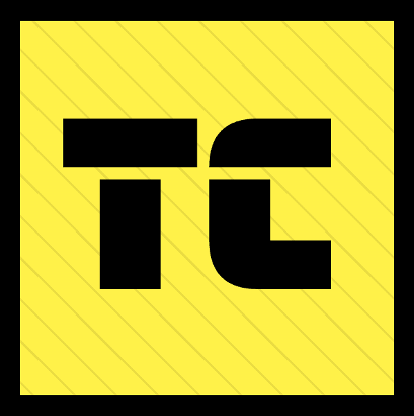

# UnlimitedSoftwareWorks

UnlimitedSoftwareWorks is the workspace for [praisethemoon](https://praisethemoon.org) where he places all of his big projects. 

Most importantly, at this time, this organization hosts the Type-C programming language eco-system:

<table>
    <tr>
        <td>
            
        </td>
        <td>
            Type-C Compiler
        </td>
    </tr>
    <tr>
        <td>
            
        </td>
        <td>
            Type-V Virtual Machine
        </td>
    </tr>
    <tr>
        <td>
            
        </td>
        <td>
            Type-C Standard Library
        </td>
    </tr>
    <tr>
        <td>
            
        </td>
        <td>
            Type-C Website and Docs
        </td>
    </tr>
</table>

## What is Type-C

Type-C is a programming language that I am designing, every aspect of the language has been designed with performance and effeciency in mind.
The language is still in early stages of development and syntax isn't set in stone just yet, so if you have any idea or thoughts, now is the time to leave your mark! 
